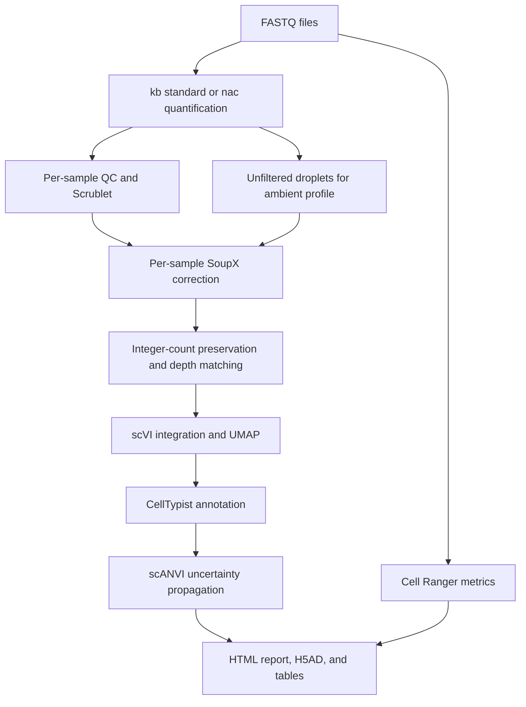

# scrna_seq.smk

Snakemake workflow for end-to-end primary analysis of droplet-based single-cell and single-nucleus RNA-seq data. It processes raw FASTQ files with [kb-python](https://www.kallistobus.tools/), collects independent Cell Ranger metrics, performs quality control and correction, integrates samples, annotates cell types, propagates annotation uncertainty, and generates a self-contained English HTML report.

!!! note

    Please make sure that [Singularity](https://sylabs.io/guides/3.7/user-guide/quick_start.html) or [Apptainer](https://apptainer.org/docs/user/latest/) and Snakemake 8.30 or later are installed, and that the [SnakeNgs](https://github.com/NaotoKubota/SnakeNgs) repository has been cloned. A reference FASTA, GTF, and the required indexes must also be available.

    The workflow currently supports paired FASTQ files from 10x droplet-based assays. Plate-based assays, multiome assays, antibody capture, and multiplex demultiplexing are outside its current scope.

## Workflow



1. Quantify gene expression with kb-python using either the `standard` or `nac` workflow.
2. Run Cell Ranger on the same FASTQ files to collect mapping and library metrics. Cell Ranger matrices are not used downstream.
3. Apply per-sample QC and identify doublets with [Scrublet](https://github.com/swolock/scrublet).
4. Estimate and remove ambient RNA separately for each library with [SoupX](https://github.com/constantAmateur/SoupX).
5. Preserve integer UMI counts, optionally match sequencing depth between samples, and create log-normalized expression values.
6. Correct technical batch effects and calculate a latent representation with [scVI](https://docs.scvi-tools.org/en/1.3.3/user_guide/models/scvi.html).
7. Assign initial cell-type labels with [CellTypist](https://celltypist.readthedocs.io/).
8. Refine labels with scANVI and retain posterior probabilities and uncertainty statistics.
9. Generate a self-contained English HTML report and publication-ready PNG, SVG, and PDF figures.

## Usage

Copy the example configuration and experiment table:

``` bash
cp examples/scrna_seq/config.yaml my_scrna_config.yaml
cp examples/scrna_seq/samples.tsv my_samples.tsv
```

Build the analysis and SoupX containers from the repository root:

``` bash
apptainer build --fakeroot containers/scrna-analysis.sif containers/scrna-analysis.def
apptainer build --fakeroot containers/scrna-soupx.sif containers/scrna-soupx.def
```

The definition files use repository-relative paths in `%files`, so these commands must be run from the repository root. If fakeroot is unavailable on the cluster, build the SIF files on a compatible host and transfer them to the cluster.

Inspect the workflow before execution:

``` bash
snakemake -s /path/to/SnakeNgs/snakefile/scrna_seq.smk \
--configfile /path/to/my_scrna_config.yaml \
--cores 16 \
--dry-run
```

Run the workflow:

``` bash
snakemake -s /path/to/SnakeNgs/snakefile/scrna_seq.smk \
--configfile /path/to/my_scrna_config.yaml \
--cores 16 \
--use-singularity \
--rerun-incomplete \
--singularity-args '--bind /path/to/fastq,/path/to/reference,/path/to/results'
```

Every executable rule specifies a container. Always use `--use-singularity`. FASTQ staging uses symbolic links, so both the source FASTQ directories and the output directory must be bind-mounted.

For GPU execution, set `integration.accelerator: gpu` and `resources.gpu: 1`, request a GPU through the Snakemake executor or cluster profile, and add `--nv`:

``` bash
--singularity-args '--nv --bind /path/to/fastq,/path/to/reference,/path/to/results'
```

Relative paths are resolved from the directory in which Snakemake is launched before the workflow changes to `workdir`. Absolute paths are recommended for cluster execution.

### Configuration file

`config.yaml` should contain the following sections. See [`examples/scrna_seq/config.yaml`](https://github.com/NaotoKubota/SnakeNgs/blob/develop/examples/scrna_seq/config.yaml) for a complete configuration.

``` yaml
workdir: /path/to/output
sample_table: /path/to/samples.tsv
input_mode: fastq
seed: 42

containers:
  kb: /path/to/kb-python.sif
  cellranger: docker://litd/docker-cellranger:v9.0.0
  analysis: /path/to/scrna-analysis.sif
  soupx: /path/to/scrna-soupx.sif

reference:
  build: false
  fasta: /path/to/genome.fa
  gtf: /path/to/genes.gtf
  index: /path/to/kb/index.idx
  t2g: /path/to/kb/t2g.txt
  cdna_t2c: /path/to/kb/cdna_t2c.txt
  intron_t2c: /path/to/kb/intron_t2c.txt

kb:
  workflow: nac
  technology: 10XV3
  count_layer: auto
  gene_symbol_column: gene_name

cellranger:
  enabled: true
  transcriptome: /path/to/cellranger/reference
  include_introns: true
  create_bam: false

integration:
  batch_key: batch
  n_hvg: 3000
  n_latent: 30
  max_epochs: 300
  accelerator: gpu
  devices: 1

celltypist:
  model: Mouse_Isocortex_Hippocampus.pkl
  model_path: /path/to/Mouse_Isocortex_Hippocampus.pkl
  majority_voting: true

scanvi:
  enabled: true
  unlabeled_category: Unknown
  max_epochs: 100
  posterior_samples: 30
```

The main configuration groups are:

| Setting | Description |
|---|---|
| `kb.workflow` | Use `nac` for nucleus RNA quantification with intronic reads or `standard` for conventional scRNA-seq quantification. |
| `reference.build` | Build a kb reference from FASTA and GTF when `true`; use the supplied index and transcript-to-gene files when `false`. |
| `cellranger.enabled` | Run Cell Ranger to collect metrics from the same FASTQ files. Its expression matrix is not used downstream. |
| `qc.*` | Configure gene, UMI, mitochondrial, hemoglobin, and within-sample MAD filters. |
| `scrublet.*` | Configure library-level doublet simulation and classification. |
| `soupx.*` | Configure empty-droplet selection, clustering, and contamination estimation. |
| `depth.*` | Configure integer UMI downsampling between samples and optional stratification. |
| `integration.*` | Configure batch keys, covariates, HVGs, latent dimensions, training epochs, neighbors, and CPU/GPU execution. |
| `celltypist.*` | Select the model by name or path and configure its checksum, majority voting, and seed-label thresholds. |
| `scanvi.*` | Configure seed-cell requirements, training epochs, posterior sampling, `Unknown` thresholds, and composition draws. |
| `annotation.*` | Map CellTypist/scANVI subtypes to configurable major cell types and select the fallback for unmapped subtypes. |
| `report.*` | Configure the title, fonts, dimensions, resolution, palette, cell-type colors, and marker genes. |
| `resources.*` | Configure threads, memory in MB, and GPU count for mapping, preprocessing, modeling, and reporting. |

`resources.analysis_mem_mb` controls memory for QC, SoupX, depth matching, and report generation. `resources.model_mem_mb` controls memory for scVI, CellTypist, and scANVI. Cell Ranger receives its memory limit in GB after conversion from `mem_mb`.

If only a CellTypist result is required, set `scanvi.enabled: false`. The report will state that scANVI uncertainty intervals were not calculated.

### Experiment table

Each row represents one droplet-capture library. Sample names may contain letters, numbers, underscores, and hyphens. Additional sequencing lanes for the same library are supplied as comma-separated R1 and R2 paths in matching order.

``` text
sample	R1	R2	batch	donor	condition	age	sex
sample1	/path/to/sample1_L001_R1.fastq.gz,/path/to/sample1_L002_R1.fastq.gz	/path/to/sample1_L001_R2.fastq.gz,/path/to/sample1_L002_R2.fastq.gz	batch1	donor1	control	P19	F
sample2	/path/to/sample2_L001_R1.fastq.gz,/path/to/sample2_L002_R1.fastq.gz	/path/to/sample2_L001_R2.fastq.gz,/path/to/sample2_L002_R2.fastq.gz	batch2	donor2	treated	P19	F
```

| Column | Description |
|---|---|
| `sample` | Unique library identifier and the unit used for doublet and ambient-RNA estimation. |
| `R1`, `R2` | FASTQ paths for read 1 and read 2. Separate multiple lanes with commas. |
| `batch` | Technical batch to correct. Do not substitute the biological condition unless they are the same experimental factor. |
| `donor` | Biological individual. Use the same value for multiple libraries from the same individual. |
| `condition` | Biological condition, such as control or treatment. |
| `age`, `sex`, and other columns | Optional metadata that can also be used to stratify depth matching. |

The workflow rejects duplicate sample IDs, repeated FASTQ files, unequal numbers of R1 and R2 files, and missing required metadata before creating the DAG. Libraries containing multiple unresolved donors must be demultiplexed before running this workflow.

### Starting from existing kb matrices

Set `input_mode: counts` to skip FASTQ mapping. The experiment table must then provide `kb_filtered` and `kb_unfiltered` H5AD files. A `cellranger_metrics` column is also required when `cellranger.enabled: true`.

``` text
sample	kb_filtered	kb_unfiltered	cellranger_metrics	batch	donor	condition
sample1	/path/to/filtered.h5ad	/path/to/unfiltered.h5ad	/path/to/metrics_summary.csv	batch1	donor1	control
```

For kb `nac` output, `kb.count_layer: auto` sums the `mature`, `nascent`, and `ambiguous` layers exactly once. Although kb-python 0.28.2 `--sum total` writes a separate MTX file, the H5AD `X` matrix still contains mature counts and is therefore not assumed to represent total UMI counts. For the `standard` workflow, `auto` uses `X`. Specify a layer name only when total counts have already been stored in that layer.

Gene IDs are retained in the final object. Gene symbols are obtained from `kb.gene_symbol_column` or from a three-column `reference.t2g` file containing transcript ID, gene ID, and gene symbol. Duplicate symbols are summed only in the annotation copy; the original gene-level matrix is preserved.

## Analysis details

### Quality control and ambient RNA correction

QC is calculated independently for each sample using genes per cell, total UMIs, mitochondrial percentage, hemoglobin percentage, and the MAD of `log1p(UMIs/genes)`. A metric with a MAD of zero does not produce a MAD-based exclusion. Scrublet is then run separately for each library. The workflow stops if Scrublet cannot determine a threshold unless a threshold is supplied explicitly.

kb's `bustools filter` constructs a called-cell allowlist, corrects nearby barcode records to that allowlist, and recounts UMIs. The filtered matrix may therefore differ slightly from the corresponding rows in the unfiltered matrix. The workflow uses the filtered matrix for QC and retained-cell counts, excludes every called barcode from the unfiltered matrix when estimating the SoupX ambient profile, and records the count differences in the QC summary for auditing.

SoupX uses `autoEstCont()` by default and rounds corrected values to integer counts with `roundToInt=TRUE` for the scVI/scANVI count likelihood. If automatic estimation is unsuitable for the dataset, `soupx.contamination_fraction` can be set after inspecting the diagnostic results.

Sample-specific random seeds are deterministic signed 32-bit integers, making them safe for NumPy, Scanpy, igraph, and the Annoy backend used by Scrublet.

After samples are combined, `obs_names` contains globally unique IDs in `sample:barcode` format and has the index name `cell_id`. The original within-library barcode remains in `obs['barcode']`.

### Library depth normalization

The workflow keeps two distinct normalization operations:

1. Within-cell library-size normalization scales each cell to 10,000 total counts and applies `log1p`. These values are used for uncorrected PCA/UMAP, CellTypist, and marker plots.
2. Between-sample depth matching applies binomial thinning to integer SoupX-corrected UMIs. For each sample, `p = target / median`. A null target uses the shallowest sample median within each `depth.groupby` stratum. Upsampling is rejected.

By default, scVI and scANVI use the full-depth `counts` layer, while `counts_depthmatched` is retained for sensitivity analyses. Set `depth.model_layer: counts_depthmatched` and use a separate work directory to train on depth-matched counts and compare both results.

### scANVI uncertainty propagation

CellTypist maximum scores, the margin between the top two scores, agreement with majority voting, and the number of seed cells are used to select training labels. Majority voting uses fine-grained Leiden clusters calculated from the scVI neighbor graph. The workflow stops when fewer than two cell classes have sufficient high-confidence seeds.

After scANVI training, repeated posterior predictions are used to store class-wise mean probabilities, standard deviations, prediction entropy, and information associated with latent sampling. Cells that fail the configured maximum-probability or normalized-entropy thresholds are labeled `Unknown`.

The composition table sums class probabilities to calculate expected cell counts, including the probability mass of cells displayed as `Unknown`. Its 2.5th and 97.5th percentiles quantify label uncertainty conditional on the observed cells and fitted model. They do not represent biological replicate variation, mapping uncertainty, SoupX uncertainty, reference-model misclassification, unknown cell types, or posterior uncertainty in model weights, and should not be interpreted as confidence intervals or p-values for biological group comparisons.

Define `annotation.major_celltype_map` for the CellTypist model and tissue being analyzed. The workflow stores both `cell_type` (subtype) and `major_cell_type` in the final AnnData object. Subtypes absent from the mapping are assigned to `annotation.unmapped_major_celltype` and listed in the report for review. The annotation section shows separate subtype and major-cell-type UMAPs. Composition is shown as stacked bars at both levels; every category receives a unique color within its plot. Optional colors can be specified with `report.celltype_colors` and `report.major_celltype_colors`.

## Output

| Path under `workdir` | Description |
|---|---|
| `report/report.html` | Self-contained English HTML report with embedded figures and links to PDF/SVG downloads. |
| `report/figures/` | Publication-ready PNG, SVG, and PDF versions of each figure. |
| `analysis/final.h5ad` | Final AnnData object with gene IDs, count layers, latent coordinates, UMAP, cell types, and class probabilities. |
| `analysis/cells.tsv.gz` | Metadata, QC measurements, labels, and uncertainty statistics for retained cells. |
| `qc/{sample}/cells.tsv.gz` | Exclusion reasons, doublet scores, and retention status for every called cell. |
| `analysis/depth.tsv` | Depth-matching targets, probabilities, observed medians, and zero-cell counts. |
| `analysis/empty_after_correction.tsv` | Cells removed because they contained zero UMIs after SoupX or depth matching. |
| `analysis/composition.tsv` | Hard and expected counts, fractions, and conditional uncertainty intervals by sample. |
| `analysis/composition_major.tsv` | The corresponding composition and uncertainty table after summing subtype probabilities into major cell types. |
| `models/scvi/`, `models/scanvi/` | Saved models. Ordered HVG names are stored in `uns['scvi_hvg_names']`. |
| `models/celltypist.json` | CellTypist model identity and SHA256 checksum. |
| `provenance/`, `logs/`, `benchmarks/` | Resolved configuration, source hashes, software versions, logs, and resource measurements. |

The count layers have the following contracts:

- `layers['counts_raw']`: unmodified integer kb UMIs for retained cells before ambient correction.
- `layers['counts']`: integer SoupX-corrected UMIs, or raw kb UMIs when SoupX is disabled.
- `layers['counts_depthmatched']`: integer counts after binomial thinning, present when depth matching is enabled.
- `X`: `log1p(CP10k)` calculated from the configured model layer.

The final object retains all genes. A separate HVG view is used only during model training. Reload a saved scANVI model using the stored HVG order:

``` python
import anndata as ad
import scvi

adata = ad.read_h5ad('analysis/final.h5ad')
hvg = adata[:, list(adata.uns['scvi_hvg_names'])].copy()
model = scvi.model.SCANVI.load('models/scanvi', adata=hvg)
```

### Figure style

The default report style uses an 8 pt font, a 180 mm figure width, 400 dpi raster output, and a color-vision-friendly Okabe-Ito palette. If Arial is unavailable, the workflow falls back to Liberation Sans and then DejaVu Sans, and records the selected font in the report.

PDF output uses Type 42 fonts, SVG output retains editable text, and dense scatter points are rasterized when needed. If the analysis contains more than eight cell types, specify `report.celltype_colors` or split the final publication figure. Inspect PDF or SVG output at its final printed size before submission.

## Testing

Run the unit and workflow tests from the repository root:

``` bash
python -m pytest -q tests/scrna
```

Create a synthetic dataset and run the complete containerized smoke test:

``` bash
python tests/scrna/make_fixture.py /tmp/scrna-smoke --train-model
snakemake -s snakefile/scrna_seq.smk \
--configfile /tmp/scrna-smoke/config.yaml \
--cores 2 \
--use-singularity
python tests/scrna/verify_smoke.py /tmp/scrna-smoke/results --reload-models
```

The synthetic fixture checks workflow connectivity and file contracts. Dataset-specific QC thresholds, reference-model suitability, biological signal preservation after integration, and inferred cell identities must be assessed from the report generated for the experimental data.

## Docker images used in the workflow

- [kb-python 0.28.2 Biocontainer](https://quay.io/repository/biocontainers/kb-python)
- [Cell Ranger 9.0.0 container](https://hub.docker.com/r/litd/docker-cellranger)
- `containers/scrna-analysis.def`, containing the pinned Python analysis environment
- `containers/scrna-soupx.def`, containing SoupX 1.6.2 and its R dependencies

Top-level dependencies are pinned. Complete package manifests are stored in `/opt/scrna-python-freeze.txt` and `/opt/soupx-conda-explicit.txt` inside the respective images. Preserve the built SIF files or use immutable image digests for reproducible reruns.

## References

- [kb-python 0.28.2 source](https://github.com/pachterlab/kb_python/tree/v0.28.2)
- [Scrublet](https://github.com/swolock/scrublet)
- [SoupX](https://github.com/constantAmateur/SoupX)
- [scVI](https://docs.scvi-tools.org/en/1.3.3/user_guide/models/scvi.html)
- [scANVI API](https://docs.scvi-tools.org/en/1.3.3/api/reference/scvi.model.SCANVI.html)
- [CellTypist](https://celltypist.readthedocs.io/en/latest/celltypist.annotate.html)
- [Cell Ranger 9 command-line arguments](https://www.10xgenomics.com/support/software/cell-ranger/9.0/resources/cr-command-line-arguments)
- [Cell Press figure guidelines](https://www.cell.com/figureguidelines)
